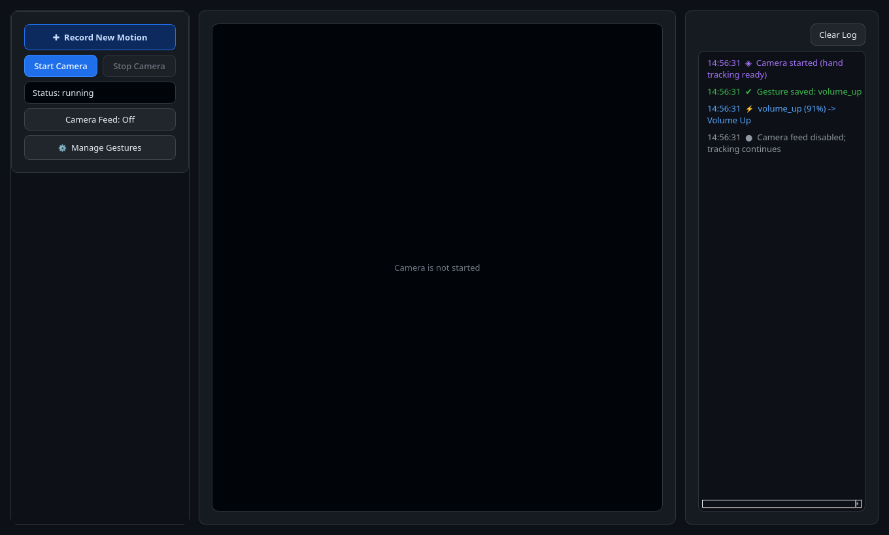
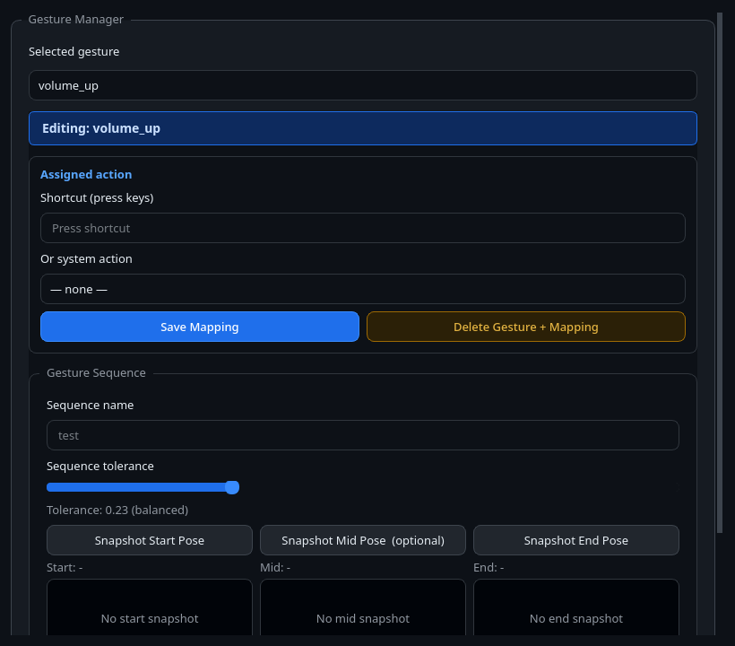
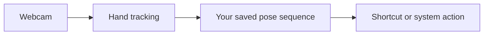

# Motion Cut

<p align="center">
	
</p>

Motion Cut is an alpha desktop app that turns custom hand motions into keyboard shortcuts. It uses a webcam, MediaPipe hand tracking, and a start-to-end pose sequence that you record yourself.

## Status

Motion Cut is an early, community-tested project. It works best for distinct, deliberate gestures such as media control or frequently used application shortcuts. Please expect rough edges and report them with the steps and platform details needed to reproduce them.

## In Action

<p align="center">
	
</p>

The main workspace keeps camera control, live preview, and runtime feedback visible at the same time. The camera image can be hidden while tracking remains active.

<p align="center">
	
</p>

The Gesture Manager opens with no selection; choose a saved motion to reveal its shortcut or system action and recorded pose sequence.

## How It Works



## Download And Run

Download the artifact for your platform from the repository's **Releases** page.

| Platform | Download | Run |
| --- | --- | --- |
| Linux x86_64 | `motion-cut-linux-x86_64` | Make it executable with `chmod +x motion-cut-linux-x86_64`, then run `./motion-cut-linux-x86_64`. |
| Windows x86_64 | `motion-cut-windows-x86_64.exe` | Double-click it. Windows may show a SmartScreen warning because releases are not code-signed. |
| macOS x86_64 | `motion-cut-macos-x86_64.tar.gz` | Extract it, move `Motion Cut.app` to Applications, then open it. Control-click and choose **Open** if Gatekeeper blocks an unsigned build. |

The executables are built on GitHub's native Linux, Windows, and macOS runners. They are not code-signed or notarized yet.

## First Use

1. Open Motion Cut and allow camera access when prompted.
2. Click **Start Camera** if the camera did not start automatically.
3. Click **Record New Motion** and give the gesture a memorable name.
4. Hold the pose you want to start from, then capture the start snapshot.
5. Move to a noticeably different ending pose and capture the end snapshot. Add the optional middle pose only when it improves reliability.
6. Save the gesture, open **Manage Gestures**, select it, and assign a keyboard shortcut or supported system action.
7. Keep your hand visible, perform the saved motion, and check the session log for detection feedback.

Use gestures with clearly different start and end poses. Stable lighting, a plain background, and consistent hand framing improve matching.

## Permissions And Platform Notes

- **macOS:** Enable Motion Cut under **System Settings > Privacy & Security > Camera**. To send shortcuts to other apps, also enable it under **Accessibility**. macOS builds are unsigned, so Gatekeeper may require Control-click > Open on first launch.
- **Windows:** Allow camera access in **Settings > Privacy & security > Camera**. Windows SmartScreen may warn about an unsigned executable.
- **Linux:** On Wayland, global shortcut injection may need `ydotool`. The source launcher attempts setup when a supported package manager is available; otherwise Motion Cut falls back to `pynput`, which may not control other apps.

## Data And Privacy

Motion Cut processes camera frames locally. It does not upload video, gesture data, or shortcuts. Saved gesture templates and mappings are stored locally in the platform user-data directory:

- Linux: `$XDG_DATA_HOME/motion-cut` or `~/.local/share/motion-cut`
- macOS: `~/Library/Application Support/motion-cut`
- Windows: `%APPDATA%\motion-cut`

Window and camera-feed preferences are stored beside this local app data on macOS and Windows, and in `$XDG_CONFIG_HOME/motion-cut` or `~/.config/motion-cut` on Linux.

## Build From Source

Requirements: Python 3.10 or newer, a webcam, and a supported desktop session.

```sh
git clone https://github.com/umitcakir/motion-cut.git
cd motion-cut
chmod +x start_motion_cut.sh
./start_motion_cut.sh
```

The launcher creates `.venv`, installs dependencies, downloads the MediaPipe models when needed, and starts the app. For a CLI camera preview instead of the desktop UI:

```sh
PYTHONPATH=src ./.venv/bin/python -m motion_cut.main --cli
```

To run tests:

```sh
PYTHONPATH=src ./.venv/bin/python -m unittest discover -s tests -v
```

## Contributing

Bug reports, compatibility results, documentation improvements, and pull requests are welcome. Read [CONTRIBUTING.md](CONTRIBUTING.md) before opening a pull request and use the issue templates when reporting a problem or suggesting an improvement.

## License

Motion Cut is available under the [PolyForm Noncommercial 1.0.0 License](LICENSE). You may use, modify, and distribute it for noncommercial purposes. Commercial use requires permission from the project owner.
